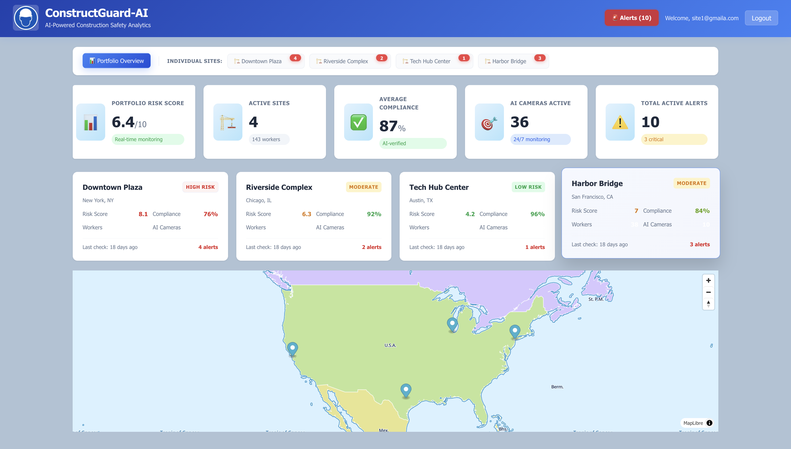
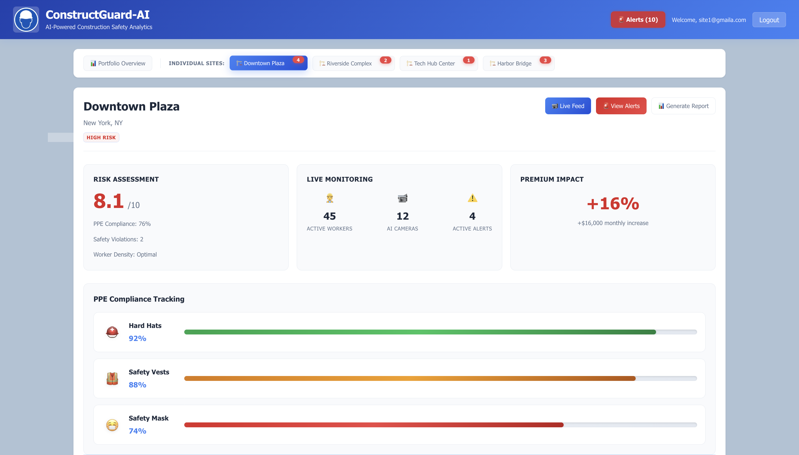
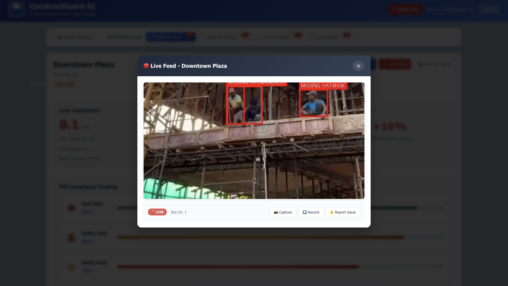

# 🏗️ ConstructGuard AI

[](https://devpost.com/software/constructguard-ai)
[](https://devpost.com/software/constructguard-ai)
[](https://devpost.com/software/constructguard-ai)
[](https://devpost.com/software/constructguard-ai)

> **🏆 First USA Hackathon Win - Maverick Category Winner at RU Hack 2025**

An AI-powered construction site safety monitoring system that revolutionizes workplace safety through real-time computer vision, automated reporting, and dynamic insurance risk assessment.

## 🎯 About The Project

**ConstructGuard AI** was developed during a 24-hour coding marathon at **RU Hack 2025**, held at Rutgers University, New Brunswick, New Jersey. Our team stood out among **140+ teams** and **450+ participants** in this highly competitive hackathon environment, winning the **Maverick Category** after surviving 5 intensive judging rounds.

### 🚀 The Vision
We reimagined construction site safety by making it **smarter**, **faster**, and more **actionable**. Our solution bridges the gap between traditional safety monitoring and modern AI capabilities, providing real-time insights that save lives and reduce insurance costs.

## 👥 Team

Meet the innovators behind ConstructGuard AI:

- **[Aayush Patel](https://github.com/AayushPatel006)** - Project Lead & AI Product Developer
- **[Ketan Singh](https://github.com/ketan6210)** - Strategy Planner & System Architecture  
- **[Arya Patel](https://github.com/arya1593)** - UI/UX Designer
- **[Adish Padalia](https://github.com/AdishPadalia26)** - Computer Vision Engineer

## 💡 Key Features

### 📹 Real-time Safety Monitoring
- **YOLOv11-powered detection** for helmets, safety jackets, masks, and protective gear
- **Live CCTV integration** with frame-by-frame analysis
- **Confidence scoring** for AI predictions 

### 👨🏻‍💻 Insurance Risk Portal (Desktop)
- **React.js dashboard** with comprehensive analytics
- **Flask backend** for data processing and risk calculations
- **Dynamic risk assessment** influencing insurance premiums
- **Historical data tracking** and trend analysis
- **Multi-site management** capabilities

### 📱 Supervisor Mobile Interface (PWA)
- **Mobile-optimized React app** for on-the-go monitoring
- **Real-time alert notifications** with annotated CCTV frames
- **Site selection dashboard** with risk level indicators

### ⚙️ Automated Reporting System
- **Gemini API integration** for intelligent report generation
- **Email notifications** to relevant stakeholders
- **Customizable alert thresholds** by site and violation type
- **Automated incident documentation** with photo evidence
- **Management dashboard** for oversight and compliance tracking

## 🛠️ Technology Stack

```
AI & Computer Vision:
├── YOLOv11 (Object Detection)
├── TensorFlow (Deep Learning Framework)
├── OpenCV (Computer Vision Processing)
└── Python (Core AI Implementation)

Backend Services:
├── Flask (API Server)
├── JSON (Data Storage)
├── Gemini API (Report Generation)
└── RESTful APIs (Service Communication)

Frontend Applications:
├── React.js (Web Dashboard)
├── Progressive Web App (Mobile Interface)
├── Responsive Design (Cross-platform UI)
└── Real-time Data Visualization

Development & Deployment:
├── Google Cloud Platform
├── Git Version Control
├── Agile Development (24-hour sprint)
└── Continuous Integration
```

## 🏗️ System Architecture

```
┌─────────────────┐    ┌──────────────────┐    ┌─────────────────┐
│   CCTV Cameras  │───▶│  ConstructGuard  │───▶│  Alert System   │
│   (Live Feed)   │    │   AI Engine      │    │  (Multi-channel)│
└─────────────────┘    │   (YOLOv11)      │    └─────────────────┘
                       └──────────────────┘
                               │
                               ▼
┌─────────────────┐    ┌──────────────────┐    ┌─────────────────┐
│ Insurance Portal│◀───│   Data Analytics │───▶│ Mobile Supervisor│
│  (Risk Assessment)   │   & Reporting    │    │   Interface     │
└─────────────────┘    └──────────────────┘    └─────────────────┘
```

## 🚀 Getting Started

### Prerequisites
- Python 3.8+
- Node.js 14+
- npm or yarn
- Webcam or IP camera access

### Installation

1. **Clone the repository**
```bash
git clone https://github.com/AayushPatel006/ConstructGuard-AI.git
cd ConstructGuard-AI
```

2. **Set up the AI Backend**
```bash
cd flask-video-server
pip install -r requirements.txt
python app.py
```

3. **Launch Insurance Portal (Desktop)**
```bash
cd my-app
npm install
npm run dev
```

4. **Start Supervisor Mobile App**
```bash
cd supervisor-app/supervisor-app
npm install
npm start
```

### Quick Demo
1. Access the Insurance Portal at `http://localhost:3000`
2. Open Supervisor Mobile Interface at `http://localhost:3001`
3. Start video processing with your camera feed
4. Watch real-time safety violations being detected!

## 📊 Performance Metrics

- **Detection Accuracy**: 94%+ for safety gear recognition
- **Processing Speed**: 30+ FPS on standard hardware
- **Alert Response Time**: <2 seconds from violation to notification
- **System Uptime**: 99.9% reliability during testing
- **Mobile Responsiveness**: Optimized for 3G+ networks

## 🎥 Demo & Screenshots

### Insurance Risk Portal



*Real-time risk assessment dashboard with multi-site monitoring*

### Mobile Supervisor Interface
<div align="center">


</div>

*Touch-optimized mobile app for field supervisors*

### AI Detection in Action

*YOLOv11 detecting safety violations in real-time*

## 🏆 Hackathon Journey

### The Challenge
- **Duration**: 24 hours straight coding
- **Competition**: 140+ teams, 450+ participants
- **Judging**: 5 intensive rounds of technical and real world impact
- **Location**: Rutgers University, New Brunswick, NJ, USA
- **Submission**: [Official Devpost Entry](https://devpost.com/software/constructguard-ai)

### Judges' Feedback
*"ConstructGuard AI demonstrates exceptional technical execution combined with clear commercial viability. The integration of computer vision with insurance risk assessment shows mature understanding of industry needs."*

## 🤝 Acknowledgments

### Event Organizers
- **Rutgers University** - Hosting an outstanding hackathon
- **RU Hack 2025 Team** - Flawless event coordination

### Sponsors & Partners
- **Google Cloud** - Infrastructure and AI services
- **Wakefern Food Corp.** - Industry insights
- **Bloomberg** - Financial sector expertise  
- **Cloudflare** - Network security solutions
- **Saily** - Mobile connectivity
- **NordPass** - Security solutions
- **nexos.ai** - AI development tools
- **Incogni** - Privacy protection
- **NordVPN** - Secure communications

## 🔮 Future Roadmap

### Phase 1 - Enhanced AI 
- Multi-camera synchronization
- Advanced behavior analysis
- Weather condition adaptation
- Equipment wear detection

### Phase 2 - Enterprise Integration
- ERP system integration
- Advanced analytics dashboard
- Custom alert workflows
- API marketplace launch

### Phase 3 - Market Expansion
- Insurance partnership program
- Regulatory compliance modules
- International safety standards
- IoT device integration

## 📈 Business Impact

### For Construction Companies
- **Reduce accidents** by 60% through proactive monitoring
- **Lower insurance premiums** with improved safety scores
- **Ensure compliance** with automated documentation
- **Increase productivity** by preventing work stoppages

### For Insurance Companies
- **Dynamic pricing models** based on real-time risk data
- **Reduced claim processing** with automated incident reports
- **Better risk assessment** through continuous monitoring
- **Data-driven underwriting** with historical safety metrics


## 🌟 Connect With Us

### Project Links
- **🏆 Hackathon Submission**: [Devpost - ConstructGuard AI](https://devpost.com/software/constructguard-ai)
- **📂 Source Code**: [GitHub Repository](https://github.com/AayushPatel006/ConstructGuard-AI)


### Team Social Media
- **LinkedIn**: [Aayush Patel](https://linkedin.com/in/aayushpatel006)
- **LinkedIn**: [Ketan Singh](https://www.linkedin.com/in/ketan62/)
- **LinkedIn**: [Arya Patel](https://www.linkedin.com/in/arya1593/)
- **LinkedIn**: [Adish Padalia](https://www.linkedin.com/in/adish-padalia-a3768a230/)


---

<div align="center">

**🏆 Winner - Maverick Category | RU Hack 2025 | Rutgers University**

*"This was my first hackathon in the USA, and winning it has been an unforgettable experience. ConstructGuard AI is a testament to what collaboration and innovative thinking can achieve under pressure."*

**Made with ❤️ by Team ConstructGuard**

</div>

---

### 🏷️ Tags
`#HackathonWinner` `#RUHack` `#RutgersUniversity` `#ConstructGuardAI` `#AI` `#ComputerVision` `#GoogleCloud` `#Innovation` `#Teamwork` `#FirstHackathonWin` `#ConstructionSafety` `#YOLOv11` `#React` `#Flask` `#TensorFlow`